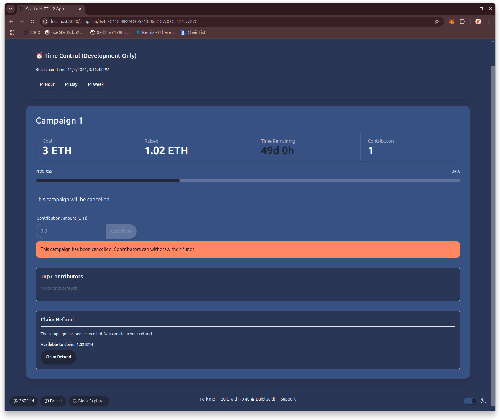
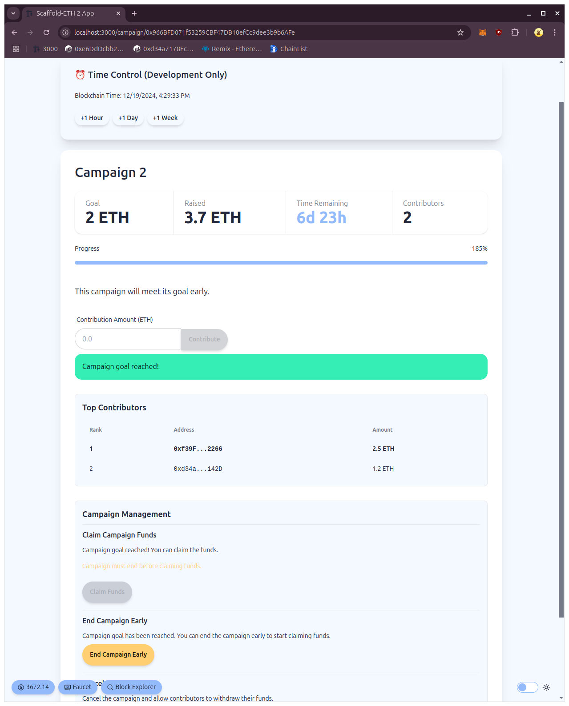

# Decentralized Crowdfunding Platform

A full-stack dApp for creating and managing crowdfunding campaigns on chain built with Solidity and Scaffold-ETH 2.

## Overview

This project implements a decentralized crowdfunding platform where:

- Users can create time-limited fundraising campaigns
- Contributors can fund campaigns with ETH
- Campaign owners can claim funds if goal is reached
- Contributors can claim refunds if campaign fails or is cancelled
- Top donors are tracked for each campaign

## Smart Contracts

### CrowdfundFactory.sol

- Factory pattern implementation for deploying new campaigns
- Maintains registry of all created campaigns
- Allows easy discovery of active campaigns

### Crowdfund.sol

Core campaign contract with features:

- Time-limited fundraising
- Goal-based success criteria
- Owner controls (cancel, end early)
- Refund mechanism
- Top donors tracking
- State management (active, ended, cancelled)

Key functions:

- `initialize()`: Set up campaign parameters
- `contribute()`: Accept ETH contributions
- `claimRefund()`: Get refunds for failed/cancelled campaigns
- `claimFunds()`: Owner claims successful campaign funds
- `cancelCampaign()`: Owner can cancel campaign
- `endCampaign()`: Owner can end successful campaign early

## Testing

Comprehensive test suite in `test/CrowdfundingTests.ts` covering:

- Campaign initialization
- Contribution handling
- Campaign cancellation
- Refund claims
- Early ending
- Fund claiming
- Top donors tracking
- Access control
- Edge cases

## Local Development

1. Clone the repository
2. Install dependencies:

```bash
yarn install
```

3. Start local chain:

```bash
yarn chain
```

4. Deploy contracts:

```bash
yarn deploy
```

5. Start frontend:

```bash
yarn start
```

6. Run tests:

```bash
cd packages/hardhat
yarn test
```

## Development Features

### Time Control

The application includes a development-only time control mechanism for testing time-dependent features:

- Located at the top of each campaign page
- Allows advancing blockchain time by hours, days, or weeks
- Shows current blockchain timestamp
- Useful for testing:
  - Campaign end conditions
  - Time-based refund claims
  - Early campaign ending
  - Campaign expiration

> Note: Time control is only available in development mode and affects the local Hardhat network's time.

## Security Features

- ReentrancyGuard for external calls
- Owner access control
- Checks-Effects-Interactions pattern
- State validation
- Custom errors for gas efficiency
- Safe math with Solidity 0.8.x

## Potential Improvements

- Add frontend/backend for serving multimedia content for the project description
- More granular access control for campaign owners
  - Allow voting on single issues
  - Tiers of rewards for different contributions based on amount / tenor
  - Allow campaign owners to set up a vesting schedule for the funds

## Technology Stack

- Solidity 0.8.20
- Scaffold-ETH 2
- Next.js
- Hardhat
- Ethers.js
- TypeScript
- TailwindCSS

## Screenshots




